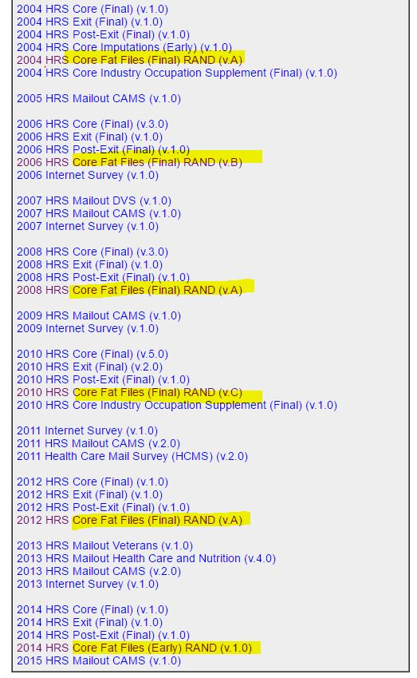

Reproducibility Instructions
===

# Environment

In order to start analysing data you will need to install [R]() and [RStudio]() on your computer. Then download this repository as a [zip archive](), unzip, and run the `map.Rproj` file to initiate RStudio session.  

SIDE NOTE: All the changes you make will be local to your machine. Optionally, you can install [github client](https://help.github.com/desktop/guides/getting-started/installing-github-desktop/), if you would like to version control your developments and share them with the master copy. If the last sentenced confused you, feel free to ignore it. 

Open RStidop session using `.Rproj` file in the root of the repository.  

# Data 

This repository does not contain any actual data. You must provide  your own data files. 

1. Log in (create the account if haven't already)
2. Proceed to [Data Download](https://ssl.isr.umich.edu/hrs/files2.php)
3. Download `Core Fat Files` shown on the image below. Save in `./data-unshared/raw/RAND-YYYY-MM-DD`

4. Unzip the files into the same folder

# Scripts 

### 0.  Ellis Island

> `./manipulation/0-ellis-island.R` 

Imports the raw `.SAV` files (SPSS format) and save unaltered data in `.RDS` format. Extracts and saves meta data for each file (one per selected wave). Adjust the `path_folder` definition as needed. 

### 1. Scale Assembly 

> `./manipulation/1-scale-assembly.R`.

Using the extracted meta data This will use dead meta data files to subset and rename relevant variables. 

### 2. Laundry Room

> `./manipulation/2-laundry-room.R`

Further cleaning of the data.

# Analysis

For a quick start, open [`./reports/look-at-data.R`](https://github.com/IALSA/HRS/blob/master/reports/look-at-data.R) and save a copy under a new name in a separate folder in `./sandbox/`. 

